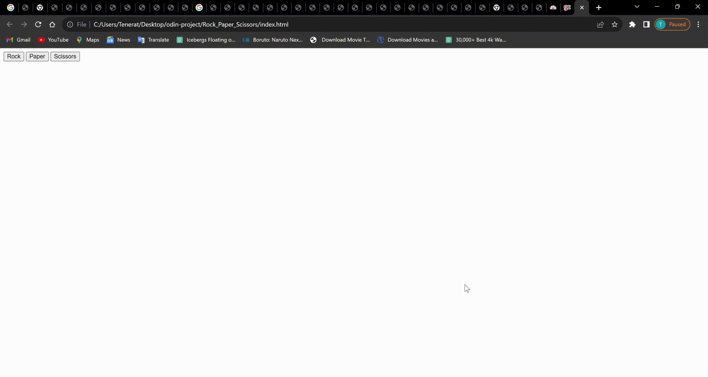

# Rock Paper Scissors Game

## Description

This is a Rock Paper Scissors game project created as part of The Odin Project's curriculum. The game is built using HTML, CSS, and JavaScript, and the development tool used is Visual Studio Code.

The main functionality of the game is to play rounds of Rock Paper Scissors against the computer. A winner is declared after 5 consecutive rounds. The player can select their choice (rock, paper, or scissors) for each round, and the computer's choice is randomly generated. The game keeps track of the player's and computer's scores, and the first player to reach 5 points is declared the winner.

## How to Play

1. Open `index.html` in your preferred web browser.
2. Select your choice (rock, paper, or scissors) for each round by clicking on the respective buttons.
3. The computer's choice will be randomly generated.
4. After 5 rounds, the winner of the game will be declared based on the scores.

## Future Improvements

This project is a work in progress, and more styling enhancements will be added eventually to make the game visually appealing and engaging.

Feel free to contribute or provide suggestions to improve the game!

## Technologies Used

- HTML
- CSS
- JavaScript
- Visual Studio Code
